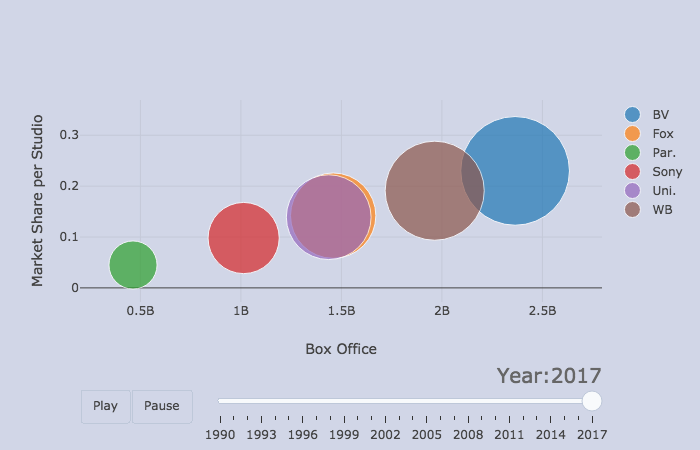
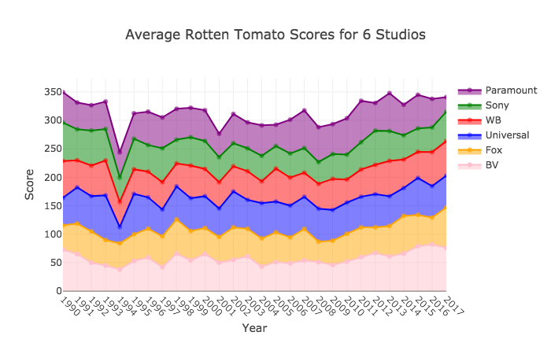

         

<h1 align="center"> Hollywood Studio Performance Analysis </h1>

 Studios Performance in Past Two Decades 

🎥

  

  <a href="#datavengers- members">Members</a> •
  <a href="#background">Background</a> •
  <a href="#proposal">Proposal</a> •
  <a href="#data-source">Data Source</a> •
  <a href="#process">Process</a> •
  <a href="#findings">Findings</a> •
  <a href="#limitations">Limitations</a> •
  <a href="#technology-stack-used">Technology Stack Used</a> •
<a href="#next-steps">Next Steps</a>

## DatAvengers Members
You can click into our Linkedins

[David Gu](https://www.linkedin.com/in/thatmandavid-gu-a0806b5a/)  |  [Lindsay Yan](https://www.linkedin.com/in/lindsay-yan-8a09469b/) | [Sean Yu](https://www.linkedin.com/in/sean-yu-733205a6/) | [Sonia Yang](https://www.linkedin.com/in/sonia-yang-69504438/) | [Tsering Sherpa](https://www.linkedin.com/in/tsering-sherpa-1171a7b4/)

## Background 

Our group is trying to compare the performance of movies that are produced in the past 27 years (1990 -2017 ) by total gross (US only), Rotten Tomato Scores, Oscar-winning movie numbers by the biggest six studios.

> * Disney (BV)
> * Warner Brothers (WB)
> * Paramount
> * Fox
> * Universal 
> * Sony

The questions we are trying to answer are:
1. Is there a clear trend for box office, quality of movies (Rotten Tomato scores), and Oscar-winning?
2. Are there any correlations between box office, quality of movies and Oscar award?
3. Who are the biggest players in each of the fields?

## Proposal 

-   Find out the market share of each studio over 27 years of time.
-   Find out how many Oscar-winning movies over time, and compare between the studios.
-  Find out whether there are correlations between box office and Rotten Tomato scores by genre.
-   Since we all love Avengers, plot out the box office of the 3 Avengers movies to illustrate the movie series' performance globally.

## Data Source

Founded in 1999, Box Office Mojo tracks box office revenue in a systematic, algorithmic way, and publishes the data on its website. In 2008 IMDb, owned by Amazon, purchased Box Office Mojo. The website is widely used within the film industry as a source of data. From 2002–11, Box Office Mojo maintained popular forums on its site.

Rotten Tomatoes is an American review-aggregation website for film and television. The company was launched in August 1998 by three undergraduate students at the University of California, Berkeley Senh Duong, Patrick Y. Lee and Stephen Wang The name "Rotten Tomatoes" derives from the practice of audiences throwing rotten tomatoes when disapproving of a poor stage performance.

The OMDb API is a RESTful web service to obtain movie information, all content and images on the site are contributed and maintained by our users.

## Process 

First, we scraped Box Office Mojo website to get the top 100 movies by year (1990- 2017) by the box office (the US only), we also scraped the 3 Avengers box office internationally for geographic visualization.

With the movie titles from Box Office Mojo, we leveraged OMDb API to pull some other information that is related to the movies (Rotten Tomato Scores, genres, directors, etc.).

After the data is pulled, we integrated all data into SQLite for plots and visualizations (We leveraged Ploty, D3, and Leaflet to realize our plots and visualizations).

Once the plots are ready, we embedded them in our homepage (designed using HTML, Bootstrap, CSS, next particle javascript library, Google Fonts).

## Findings 

Overall the movie industry is performing in a growing trend over the 27 years. BV is the fastest grower, where it takes up 28% of the market share among all Big studios in 2017. We can tell that BV is really into making great movies. No matter the box office or Rotten Tomatoes scores, BV has been at the top of the chart for recent years.

The top Gross movies usually do not have perfect Rotten Tomatoes scores, the high Rotten Tomatoes scores movies are traditionally low regarding revenue. Therefore we found the negative correlation between box office and Rotten Tomatoes scores. But BV is trying to break this norm by producing a lot of the high-quality movies that perform highly on both scales in recent years.

By taking the example of Avengers, we found out that North America has the enormous box office opportunities for Hollywood movies. China is the second largest market outside of North America. This is a clear sign for the big six studios to market in China to achieve higher box office internationally.

## Limitations 
The limitation is the amount of data we have, if we could have access to their investment in the movies, we can perform some other exciting analysis.

## Technology Stack Used

-   SQL
-   Python
-   Javascrpit
-   html/css/leaflet

## Next Steps

If given the investment data, we can perform ROI analysis for movie studios to see which studios make the most revenue other than gross income.

We would also like to explore the box office vs. how many theaters are playing and how many showtimes each movie has to calculate some metric for earnings per show and see which studio has the top average earnings per show.
